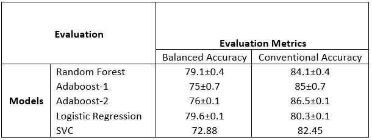
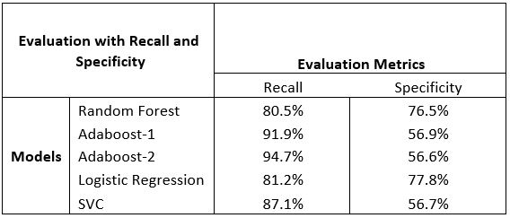

# Weather-prediction-in-Australia-via-Machine-Learning

This repository focusses on the rain prediction over Australia. The dataset was gathered from Kaggle (https://www.kaggle.com/jsphyg/weather-dataset-rattle-package).  
The features of the dataset introduced below:    
**Date:** The date of observation  
**Location:** The common name of the location of the weather station  
**MinTemp:** The minimum temperature in degrees celsius  
**MaxTemp:** The maximum temperature in degrees celsius  
**Rainfall:** The amount of rainfall recorded for the day in mm  
**Evaporation:** The so-called Class A pan evaporation (mm) in the 24 hours to 9am  
**Sunshine:** The number of hours of bright sunshine in the day  
**WindGustDir:** The direction of the strongest wind gust in the 24 hours to midnight  
**WindGustSpeed:** The speed (km/h) of the strongest wind gust in the 24 hours to midnight  
**WindDir9am:** Direction of the wind at 9am  
**WindDir3pm:** Direction of the wind at 3pm  
**WindSpeed9am:** Wind speed (km/hr) averaged over 10 minutes prior to 9am  
**WindSpeed3pm:** Wind speed (km/hr) averaged over 10 minutes prior to 3pm  
**Humidity9am:** Humidity (percent) at 9am  
**Humidity3pm:** Humidity (percent) at 3pm  
**Pressure9am:** Atmospheric pressure (hpa) reduced to mean sea level at 9am  
**Pressure3pm:** Atmospheric pressure (hpa) reduced to mean sea level at 3pm  
**Cloud9am:** Fraction of sky obscured by cloud at 9am. This is measured in "oktas", which are a unit of eigths. It records how many eigths of the sky are obscured by cloud. A 0 measure indicates completely clear sky whilst an 8 indicates that it is completely overcast  
**Cloud3pm:** Fraction of sky obscured by cloud (in "oktas": eighths) at 3pm. See Cload9am for a description of the values  
**Temp9am:** Temperature (degrees C) at 9am  
**Temp3pm:** Temperature (degrees C) at 3pm  
**RainTodayBoolean:** 1 if precipitation (mm) in the 24 hours to 9am exceeds 1mm, otherwise 0  
**RISK_MM:** The amount of next day rain in mm. Used to create response variable RainTomorrow. A kind of measure of the "risk"  
**RainTomorrow:** The target variable. Did it rain tomorrow?  
 
Most of the kernels made for this dataset introduced bias into their model since they used whole dataset for scaling, imputation of missing values etc. and they included RISK_MM into their model which is a feature for creating the target variable. It has the information of the amount of rain of the next day so if it is some value other than zero it means it will rain tomorrow. So if that feature included in to the model there is no point of rain prediction for the next day. The aspect of multicollinearity studied which also misread in some kernels. Being a classification problem, this work is going to tackle this problem with KNN, Decision Trees, Random Forest and Logistic Regression, and at the end compare their results. As an evaluation method, instead of accuracy, as it was also discussed in the discussions F1_Score can be a good evaluation method to evaluate the models however it is hard to explain that is why balanced accuracy used as an evaluation metric to see the arithmetic mean of sensitivity (true positive rate) and specificity (true negative rate).If classifier does well on both class this metric will be close to the conventional accuracy score however if it does well on one class and does bad in another class it will be much lower than the conventional accuracy metric. Since all the models used accuracy it is also going to be calculated to compare the model with other kernels, but balanced accuracy of the models is going to be used to compare this work’s models. To summarize, for having least possible bias in the model, the plan is to deal with multicollinearity and missing values carefully (impute them rather than deleting the whole column), dividing the dataset into training and testing at the right moment, are some fruitful avenues to pursue.  
## Data Understanding
### Data Exploration 
For data exploration part descriptive statistics were listed to see each attribute's counts, means, standard deviations, min values, max values and percentiles. Then balance for the target RainTomorrow values were checked. 22.42% of the dataset has “Yes” and 77.58% of them has “No”. That balance will be checked again after handling the missing values. After checking the target balance, for the numerical attributes, histograms and probability plots were created to see if they normally distributed or not. From those, it can be seen that some of the distribution does not conform exactly to a normal distribution. Humidity9am, Sunshine are negatively skewed and Evaporation, Rainfall, WindGustSpeed, WindSpeed9am and WindSpeed3pm are positively skewed. After checking distributions, the linear relationship between the attributes were checked with correlation. 0.85 was selected for the threshold and heatmap created for the pairwise correlations. Highly correlated attributes (-0.85 > threshold > 0.85) are Temp3pm and MaxTemp: 0.98, Pressure9am and Pressure3pm: 0.96, Temp9am and MinTemp: 0.9, Temp9am and MaxTemp: 0.89, Temp9am and Temp3pm: 0.86. Those highly correlated attributes will be removed in the data preparation part. 
### Data Quality 
For identifying missing values, each attribute's null percentages were counted. ~48% of the Sunshine values, ~43% of the Evaporation values, ~40% of the Cloud3pm values, ~38% of the Cloud9pm values are missing.  
## Data Preparation  
### Splitting dataset and excluding target
The dataset divided into training and testing datasets 65%and 35% respectively before making any decisions on the preparation section. This is done before the preparation process because doing the decisions about pre-processing on whole data introduces bias to the model.  
### Dimensionality reduction (Removing correlated attributes) 
As mentioned before in the data exploration part, highly correlated attributes were removed. After identifying two highly correlated attributes (Temp3pm – MaxTemp: 0.98), average of their correlation with other attributes were calculated and MaxTemp (attribute with the highest average correlation (MaxTemp average correlation with other attributes: 0.148, Temp3pm average correlation with other attributes: 0.141)) was removed. This process was repeated until there was no correlation remain higher than threshold. After removing MaxTemp, Pressure3pm, MinTemp and Temp9am removed respectively.  
### Missing Data Handling 
Missing values dealt in R programming language since R contains more packages for dealing with missing values. First, the percentage of the missing values shown because even if the attributes with less than 5% missing values are not missing completely at random (MCAR), listwise deletion can be used to delete them (Shafer,1999).Attributes Temp3pm, Rainfall, WindSpeed9am, WindSpeed3pm, Humidity9am and Humidity3pm had less than 5% missing values and their missing values deleted without the need for analyzing MCAR or not. Then for attributes that has more than 5% MCAR test conducted. First, the intention was using Little’s MCAR (Little, 1988) test however, it is computationally expensive and too sensitive for large datasets (Li, 2014), that is why analyzing the graphs gave sufficient information. There is no evidence found that, attributes Cloud3pm, Cloud9am, WindGustSpeed, Pressure9am, Evaporation and Sunshine are not MCAR. Since those attributes have MCAR characteristics MCAR listwise deletion can be used without having the concern of having a biased effect or incorrect variances (Little, 1988) however, one study showed that listwise deletion leads to a decrease in statistical power if more than %10 of data is missing (Raaijmakers, 1999). So listwise deletion applied only Cloud3pm and Cloud9am attributes, others had much more missing values than 10% so another method is needed. Imputation models that can deal with MCAR can easily be implemented for WindGustSpeed, Pressure9am, Evaporation and Sunshine. To deal with missing values of those attributes, bagging ensemble algorithm imputation method chosen because it can deal with both categorical and numerical values also it doesn't need scaling which is going to be the next part in the process.  
### Converting categorical attributes into binary 
The target variable (RainTomorrow) and RainToday variables values are coded as Yes and No. They are changed to 1 and 0 respectively. Since WindGustDir, WindDir9am and WindDir3pm are categorical variables they were encoded to dummy variables. Location had more than 30 distinct categories so in order not to have a lot of columns which will result in a computationally expensive model, they were recoded with label encoding. After converting all variables, feature space increased from 19 to 62.  
### Scaling
The dataset scaled with z-score. It seems an easy process however if the scaling is done before splitting the model or calculated for both training and test and apply them separately this process may end up leaking information to the model. That is why scaling is calculated on training set and those constants then applied to training and testing sets respectively.  
### Oversampling
As mentioned in the data understanding part this dataset is highly imbalanced (77.58%-Yes and 22.42%-No). In order to balance it, it is decided to use oversampling because under sampling results in reducing the instances and also it might not take some distinct instances in the under sampled set which may affect the results poorly. There are more than one over sampling techniques present however not all are efficient sampling techniques. This project uses SMOTE as oversampling technique because it introduces new synthetic samples rather than randomly choosing existing samples and increasing their occurrence (Weiss et al., 2007). Regular oversampling techniques tend to overfit since they may learn some specific examples too well, which will result in memorization rather than generalization. SMOTE learns the topological properties of the minority class and creates new classes not same as the originals but similar so it reduces the chance of overfitting. After oversampling dataset instances increased from 77688 to 121398.  
## Modelling
Since our problem is classification random forest, adaboost, logistic regression and support vector classifier selected as model to do the classification. To fine tune the hyperparameters grid search is used however for SVC even training the model took 2 hours so grid search isn’t used for SVC model, in addition to that to select best features first feature importance examined for random forest and sorted from best to worst. Then, a loop created which tests the model with feature set that started with 1 and increased one by one.  
### Random Forest
The random forest instance created then for fine tuning grid search used. Grid search model tried 3 different number of trees (50,100,200) with tree depth ranging from 10 to 40. Since this project focuses on balanced accuracy rather than conventional accuracy for grid search the scoring method chosen as balanced accuracy. Lastly, 5-fold cross validation used in order to test the results. Then the model applied to the test set and the balanced accuracy and conventional accuracy found 78.59% and 82.79% respectively and the best hyperparameters for that model was, number of trees=200, max tree depth=15. Then the features sorted according to their importance to prepare a list for feature selection. After that, a for loop is generated to analyse with how many features(from high important to low) the model performs better, and the model gave best results with 53 features leaving 9 out, the graph shown on the right. The results after that operation changed. Test results for balanced accuracy and conventional accuracy increased to 79.07%±0.4 and 84.06%±0.4 respectively with 95% confidence interval.  
### Adaboost
Two adaboost models created and compared with each other. First model used grid search for tuning the hyperparameters and it used 4 different number of estimations (50,100,200,300) with 3 learning rate options (0.5,1,1.5). Scoring chosen as balanced accuracy; 5-fold cross validation used for training process of grid search. Test results for balanced accuracy and conventional accuracy, 74.96%±0.7 and 84.98%±0.7 respectively with 95% confidence interval. The best parameters was number of estimations=300, learning rate=1.5. In the first model base tree kept as default (DT with max depth=1) but in the second model it changed to random forest with max depth=10 and number of estimators=50 which was proven to give test results (balanced accuracy=78.50% – accuracy=81.50%) similar to the random forest that built before adaboost. Second model haven’t used any model for hyperparamter tuning to save computational time (same gridsearch model applied and after 5 hours it was still runing). The second models balanced accuracy and accuracy results were 76%±0.1 and 86.47%±0.1 respectively with 95% confidence interval.  
### Logistic Regression
Logistic model created also with grid search to fine tune the hyperparameters of logistic regression. According to the sklearn documentation saga is often the best solver and saga’s capabilities of handling large datasets are the reasons why saga chosen as a solver method. Both lasso and ridge regression regularizations(l1,l2) chosen for grid search with both 0.5 and 1.5 learning rates, max iteration kept as default at first, but the model gave a warning about converging (not converged), so iterations set to 500. Again 5-fold cross validation chosen, and the model is trained with hyperparameters defined above. Test results for balanced accuracy and conventional accuracy were 79.56%±0.1 and 80.32%±0.1 respectively with %95 confidence interval. The best hyperparameters for the model were penalty=l2 and learning rate=1.5.  
### SVC
Support Vector Classifier built with no hyperparameter tuning to save computational time because only for training svc model took 3 hours 12 minutes. As kernel polynomial chosen to speed up the process since with rbf after 4 hours there was no results. To have 1 / (n_features * X.var()) as gamma scale version of gamma chosen and the model trained. Test results for balanced accuracy and conventional accuracy were 72.88% and 82.45% respectively.  

## Evaluation
Models trained and tested. All the models have higher accuracy then balanced accuracy. This happened because the models seem to predict one class more accurate than the other. To see which class is favored by the models recall and specificity calculated. It is certain that, sunny days tend to be predicted more accurate than rainy days even with oversampled training data. It seems that when balanced accuracy and conventional accuracy gets closer models equal prediction capacity increases. Since it was one of the fruitful avenues our model is based on, this project has an aim that is better to predict rainy and have sun as a surprise rather than other way around. Although having the highest conventional accuracy, Adaboost-2 model acted poorly on predicting the rainy days. It predicted sunny days with outstanding 94.7% accuracy but when it comes to predict rainy days it only reached 56.6% worst or all models, which is slightly better than flip a coin before going out to decide whether to take an umbrella or not. The model that has highest balanced accuracy also has the highest accuracy on predicting rainy days with a 77.8% accuracy (Specificity), which is logistic regression. When all things taken into consideration for this dataset logistic regression seems to be the best model for this projects cause. It is also useful to inform that, however when all the kernels considered and the overfitted and biased ones excluded Adaboost-2 has the best accuracy score among all kernels.  
  
  

### REFERENCES
Little’s Test of Missing Completely at Random li, 2014  
Effectiveness of Different Missing Data Treatments in Surveys with Likert-Type Data: Introducing the Relative Mean Substitution Approach, Raaijmakers,1999 Weiss, Gary M., Kate McCarthy, and Bibi Zabar. "Cost-sensitive learning vs. sampling: Which is best for handling unbalanced classes with unequal error costs?." DMIN 7 (2007): 35-41.  
Roderick J. A. Little. (1988). A Test of Missing Completely at Random for Multivariate Data with Missing Values. Journal of the American Statistical Association, 83(404), 1198-1202. doi:10.2307/2290157  
Schafer JL. Multiple imputation: a primer. Stat Methods Med Res. 1999;8:3–15  

